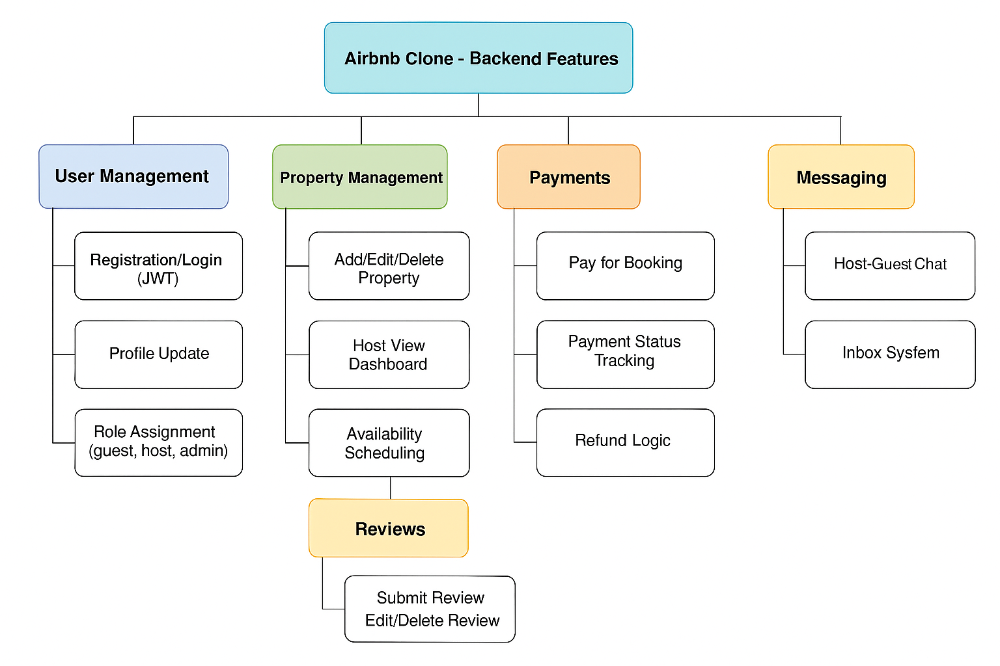

# Airbnb Clone - Backend Features & Functionalities

This diagram outlines the core backend features for the Airbnb Clone project.

## Key Modules

- **User Management**: Authentication, registration, profile management
- **Property Management**: CRUD operations on listings
- **Booking System**: Browse, book, and manage reservations
- **Payments**: Secure payment processing and status tracking
- **Reviews**: Submit and view property reviews
- **Messaging**: Host/guest communication system
- **Admin Panel**: Admin moderation tools and analytics

